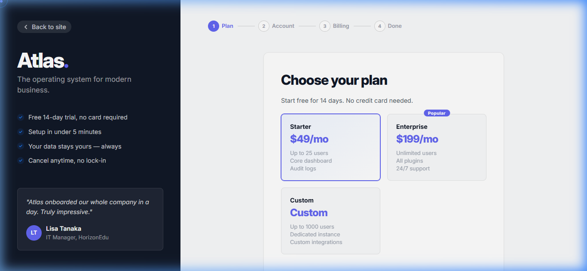

# Atlas — Enterprise Application Platform (SaaS)

<p align="center">
  <strong>A modular, multi-tenant SaaS platform for enterprise software</strong><br/>
  Subscribe, spin up your own organization, and extend it with independently deployable plugins — all on a shared, event-driven core.
</p>

---

## 📸 Workspace Previews

### Onboarding & SaaS Landing Page


_SaaS Portal Homepage featuring modular pricing and plans_


_4-step subscription onboarding flow for client workspaces creation_

### Multitenant Workspace (Theme & Adaptability Preview)


_Enterprise plan client dashboard running in dark mode with all plugins enabled_


_Starter plan client dashboard running in light mode featuring metrics widgets limits_

---

## ✨ What is Atlas?

Atlas is a **subscription-based SaaS platform**. Businesses sign up, create their own isolated organization (tenant), and pick the plugins they need — CRM, HR, Inventory, Analytics, and more — instead of buying and maintaining separate point solutions.

- 🏢 **Multi-tenant by design** — every organization gets isolated data and its own users, roles, and configuration.
- 💳 **Subscription-driven** — plans unlock which plugins and limits an organization gets access to, with a 14-day free trial on every tier.
- 🧩 **Plugin marketplace** — enable or disable business modules per organization without redeploying the platform.
- 🛠️ **Built for extension** — new plugins are built once against the Atlas Framework Layer and become available to every subscribed organization.

---

## 🏗️ Architecture

Atlas separates enterprise software into five layers, with subscription/tenant management sitting on top of the platform:

```
┌─────────────────────────────────────────────────────────────┐
│                SaaS Layer (Portal & Subscriptions)           │
│   Marketing Site  │  Signup & Onboarding  │  Platform Admin  │
└─────────────────────────────┬───────────────────────────────┘
                               │
┌─────────────────────────────▼───────────────────────────────┐
│              Business Application Layer (Plugins)            │
│   Inventory  │  CRM  │  HR  │  Analytics  │  ...more         │
└─────────────────────────────┬───────────────────────────────┘
                               │
┌─────────────────────────────▼───────────────────────────────┐
│                    Atlas Framework Layer                     │
│  @atlas/ui  │  forms  │  grid  │  api  │  events  │  sdk     │
└─────────────────────────────┬───────────────────────────────┘
                               │
┌─────────────────────────────▼───────────────────────────────┐
│                      Core Platform Layer                     │
│  Auth  │  Organizations  │  Users  │  Plugins  │  Audit      │
└─────────────────────────────┬───────────────────────────────┘
                               │
┌─────────────────────────────▼───────────────────────────────┐
│                    Infrastructure Layer                      │
│  PostgreSQL  │  Redis  │  Docker  │  BullMQ  │  Nginx        │
└─────────────────────────────────────────────────────────────┘
```

**How it fits together:**

1. A prospective customer subscribes through the **SaaS portal**, choosing a plan.
2. This provisions a new **Organization** (tenant) with its own isolated data.
3. The org's admin enables the **plugins** included in their plan from the plugin manager.
4. Every plugin is built on the shared **Atlas Framework Layer**, so it looks, feels, and behaves consistently.
5. The **Core Platform Layer** enforces auth, roles/permissions, and auditing across every tenant.

---

## 📦 Monorepo Structure

Detailed descriptions are provided in their respective folder index:

- **Deployable Applications:** [apps/README.md](apps/README.md)
  - SaaS Portal: [saas-portal](apps/saas-portal/README.md)
  - Product Frontend: [frontend](apps/frontend/README.md)
  - Backend API: [backend](apps/backend/README.md)
  - Background Worker: [worker](apps/worker/README.md)
- **Shared Packages Framework:** [packages/README.md](packages/README.md)
- **Business Plugins Modules:** [plugins/README.md](plugins/README.md)

---

## 💳 Plans & Plugins

| Plan           | Price      | Plugins & Limits                                                                                                     |
| -------------- | ---------- | -------------------------------------------------------------------------------------------------------------------- |
| **Starter**    | $49/mo     | Core platform, limited seats, pick your plugins                                                                      |
| **Enterprise** | $199/mo    | Unlimited users, all plugins (CRM, HR, Inventory, Analytics), priority 24/7 support, custom roles & permissions, SSO |
| **Custom**     | Contact us | Tailored limits, plugins, and support for large organizations                                                        |

---

## 🛠️ Tech Stack

| Layer       | Technology                                              |
| ----------- | ------------------------------------------------------- |
| SaaS Portal | React, TypeScript, Vite                                 |
| Frontend    | React, TypeScript, Vite, React Router                   |
| Backend     | NestJS, TypeScript, Prisma (multi-schema, multi-tenant) |
| Database    | PostgreSQL                                              |
| Cache       | Redis                                                   |
| Queue       | BullMQ                                                  |
| Containers  | Docker, Docker Compose                                  |

---

## 🚀 Getting Started

### Prerequisites

- Node.js >= 20
- pnpm >= 9
- Docker & Docker Compose

### Setup

```bash
# Install dependencies
pnpm install

# Start infrastructure (PostgreSQL, Redis)
docker compose up -d

# Run database migrations
pnpm --filter @atlas/backend db:migrate

# Seed database
pnpm --filter @atlas/backend db:seed

# Start development servers (saas-portal, frontend, backend)
pnpm dev
```

By default:

- **SaaS portal** (marketing, pricing, signup, platform admin) → `http://localhost:5174`
- **Product frontend** (used by subscribed organizations) → `http://localhost:5173`
- **Backend API** → `http://localhost:3000`

---

## 🧩 Building a Plugin

New business modules are built against `@atlas/atlas-plugin-sdk` and dropped into `plugins/`. Each plugin ships a `manifest.json` declaring its id, permissions, routes, and widgets — the backend's Plugin Manager auto-discovers it, registers it, and makes it available for organizations to enable based on their subscription.

---

## 📄 License

MIT

---

**Atlas** — _Build enterprise platforms, not enterprise applications._
