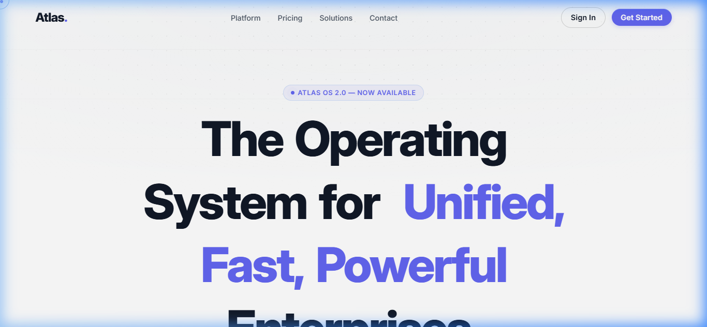
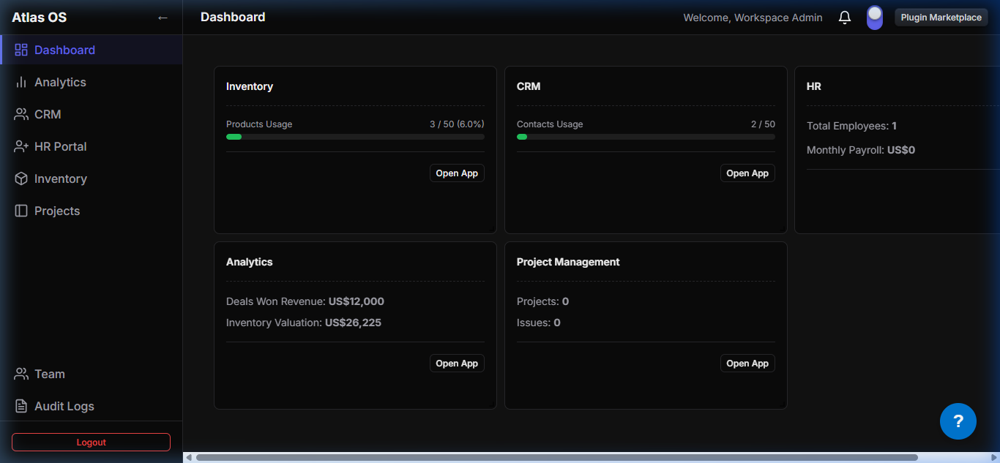
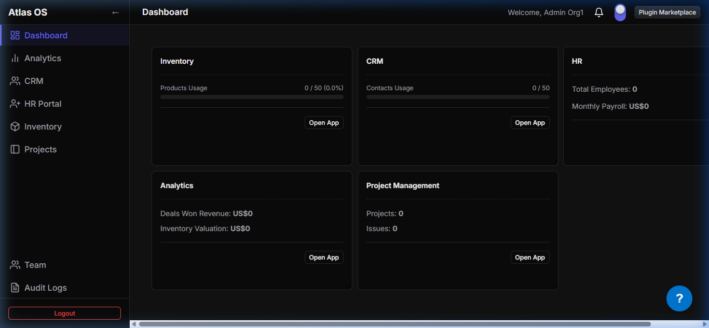

# `apps/`

This directory contains every deployable application in the Atlas monorepo. Atlas is split into a **SaaS-facing layer** (subscriptions, tenant provisioning) and a **product layer** (the actual platform an organization uses once subscribed), plus supporting services.

- **SaaS Portal & Admin Console:** [saas-portal](saas-portal)
- **Product Workspace Client:** [frontend](frontend)
- **Core API Engine:** [backend](backend)
- **Background Worker:** [worker](worker)

---

## Workspace Previews

### SaaS Onboarding & Landing (Light/Dark Adaptability)


_SaaS Portal Homepage featuring plans pricing matrix_

### Enterprise Workspace (Dark Theme)


_Tenant client dashboard running in dark mode with all plugins active_

### Starter Workspace (Light Theme)


_Tenant client dashboard running in light mode on the Starter tier plan_

---

## applications shape

| App                           | Role                                                | Stack                        | Default Port |
| ----------------------------- | --------------------------------------------------- | ---------------------------- | ------------ |
| [`saas-portal`](#saas-portal) | Marketing, pricing, signup & platform admin         | React + TypeScript + Vite    | `5174`       |
| [`frontend`](#frontend)       | Product app used by subscribed organizations        | React + TypeScript + Vite    | `5173`       |
| [`backend`](#backend)         | Core API — auth, orgs, users, roles, plugins, audit | NestJS + TypeScript + Prisma | `3000`       |
| [`worker`](#worker)           | Background job processing                           | BullMQ (Node)                | —            |

---

## `saas-portal`

The public-facing entry point to Atlas as a product. This is where a prospective customer lands, compares plans, and signs up — and where Atlas staff manage the platform across all tenants.

```
saas-portal/
├── src/
│   ├── components/
│   │   ├── Hero/            # Landing page hero section
│   │   ├── About/           # Product/company overview
│   │   ├── Solutions/       # Plugin/solution highlights
│   │   ├── Pricing/         # Plan tiers, pricing table, CTA
│   │   ├── Testimonials/    # Social proof
│   │   ├── Contact/         # Contact / sales form
│   │   ├── GridBackground/  # Landing page visual background
│   │   └── CursorDot/       # Landing page cursor effect
│   └── pages/
│       ├── Signup/          # Organization signup & plan selection
│       └── Admin/           # Platform admin console (cross-tenant view)
```

**Responsibilities:**

- Renders the marketing site (hero, pricing, testimonials, contact).
- Handles new organization **signup**, including plan selection (`?plan=starter|enterprise|custom`).
- Hosts the **platform admin console** — the internal view Atlas staff use to oversee organizations, health scores, and MRR, distinct from any single tenant's own admin area.

**Run it:**

```bash
pnpm --filter saas-portal dev
# → http://localhost:5174
```

---

## `frontend`

The actual product. Once an organization is provisioned, its users log in here to work — this is the multi-tenant workspace where enabled plugins render.

```
frontend/
├── src/
│   ├── components/     # Shared UI building blocks
│   ├── contexts/        # React context providers (auth/session, etc.)
│   ├── pages/
│   │   ├── Welcome/      # Post-login landing
│   │   ├── Login/        # Organization member login
│   │   ├── Setup/        # First-run org/user setup
│   │   ├── Dashboard/     # Home dashboard, widgets
│   │   ├── Team/          # User & role management for the org
│   │   ├── Store/         # In-app plugin store — enable plugins on the org's plan
│   │   ├── AuditLogs/      # Org-level audit trail
│   │   └── Admin/          # Org-level admin settings
│   └── plugins/          # Plugin host — dynamically mounts enabled plugin UIs
```

**Responsibilities:**

- Authenticates organization members against the backend (JWT-based).
- Renders whichever plugins (CRM, HR, Inventory, Analytics, …) the organization has enabled, via a dynamic plugin-loading layer (`src/plugins`).
- Provides the **Store** page for org admins to enable/disable plugins included in their subscription.
- Surfaces org-scoped audit logs, team/role management, and dashboard widgets from `@atlas/atlas-dashboard` / `@atlas/atlas-widgets`.

**Run it:**

```bash
pnpm --filter frontend dev
# → http://localhost:5173
```

> Note: in dev, requests to `/api/analytics` are proxied to the Python-based analytics engine (`http://127.0.0.1:8000`) shipped with the `analytics` plugin.

---

## `backend`

The core Atlas API. Every tenant, every user, every plugin registration flows through here.

```
backend/
├── prisma/
│   ├── schema.prisma     # Multi-schema Postgres schema (core, inventory, crm, hr, …)
│   ├── migrations/
│   └── seed.ts
└── src/
    ├── auth/               # Register/login/refresh, JWT strategy, RBAC guards & decorators
    ├── users/              # User CRUD, scoped to an organization
    ├── roles/              # Role & permission management (RBAC)
    ├── plugins/             # Plugin discovery, registration & lifecycle (Plugin Manager)
    ├── audit/               # Audit logging across the platform
    ├── admin/              # Platform-level admin endpoints (cross-org metrics, health, MRR)
    ├── health/              # Health check endpoint
    ├── prisma/              # Prisma service/module
    ├── common/              # Global filters & interceptors
    ├── app.module.ts
    └── main.ts
```

**Responsibilities:**

- **Multi-tenant data model** — Prisma's `multiSchema` feature isolates each domain (`atlas_core`, `atlas_inventory`, `atlas_crm`, `atlas_hr`) while every row is still scoped to an `Organization`.
- **Auth & RBAC** — JWT access/refresh tokens, `@Permissions()` decorator + guard, `@Public()` for unauthenticated routes.
- **Plugin Manager** — discovers plugins under `plugins/` at the repo root, reads each `manifest.json`, and upserts a `Plugin` row (`status: AVAILABLE | INSTALLED | ENABLED | DISABLED`).
- **Platform Admin API** — separate from an org's own admin area; backs the `saas-portal` admin console with cross-tenant data (organization health score, MRR, support tickets).
- **Audit** — every sensitive action is logged and queryable per organization.
- Global API prefix: `/api/v1`. Interactive API docs (Swagger) served at `/docs`.

**Run it:**

```bash
pnpm --filter backend db:generate   # generate Prisma client
pnpm --filter backend db:migrate    # run migrations
pnpm --filter backend db:seed       # seed sample data
pnpm --filter backend dev
# → http://localhost:3000/api/v1
# → Swagger docs: http://localhost:3000/docs
```

---

## `worker`

Background-processing service running BullMQ queue consumers (e.g. plugin provisioning jobs, scheduled reports, notification delivery) outside the request/response cycle of the backend API.

See the dedicated [worker README.md](worker/README.md) for more details.

---

## Running everything together

From the repo root:

```bash
pnpm install
docker compose up -d          # PostgreSQL, Redis
pnpm --filter backend db:migrate
pnpm --filter backend db:seed
pnpm dev                      # runs saas-portal + frontend + backend in parallel
```

| Service                                         | URL                            |
| ----------------------------------------------- | ------------------------------ |
| SaaS portal (marketing, signup, platform admin) | `http://localhost:5174`        |
| Product frontend (org workspace)                | `http://localhost:5173`        |
| Backend API                                     | `http://localhost:3000/api/v1` |
| API docs (Swagger)                              | `http://localhost:3000/docs`   |
