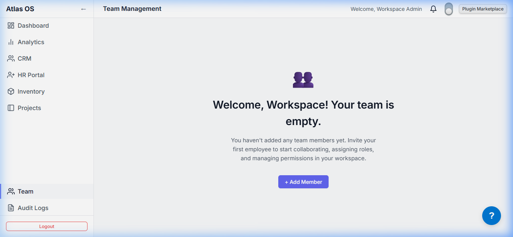
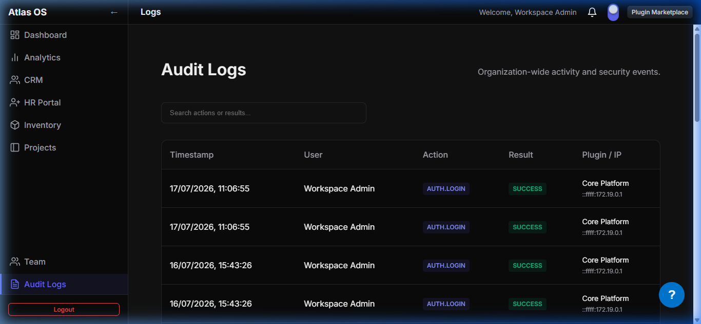
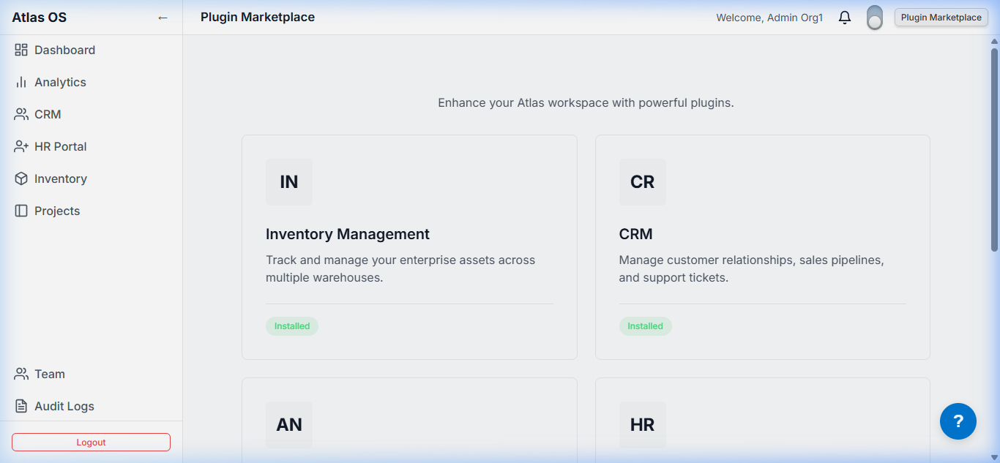
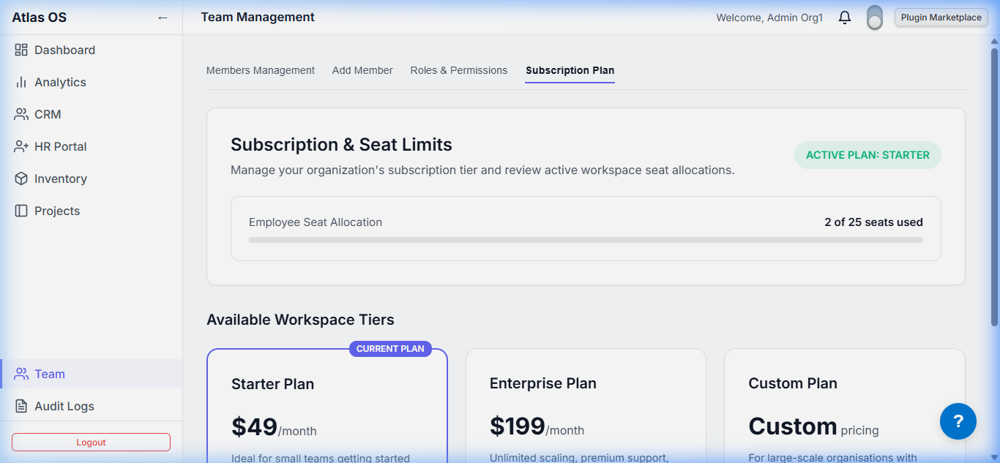

# `apps/frontend`

The product itself — the workspace an organization's users log into once their org is subscribed. Renders the core shell (dashboard, team, audit logs, plugin store) and hosts every plugin's UI.

- **Framework:** React 18 + TypeScript + Vite
- **Routing:** `react-router-dom`
- **Default port:** `5173`
- **API base URL:** `VITE_API_URL` env var, falling back to `http://localhost:3001/api/v1` (see note below)

---

## Previews (Theme & Tier Adaptability)

The frontend adapts its theme (Light vs. Dark) and layout dynamically depending on the tenant's user preference and subscription limits.

### 1. Enterprise Workspace View (Dark Mode)


_Fully unlocked Enterprise dashboard with CRM, HR, Inventory, and Analytics plugins active_

```carousel

<!-- slide -->

```

_Enterprise plan workspace showing unlimited member seats capacity and organizational audit trail logs_

### 2. Starter Workspace View (Light Mode)


_Starter plan workspace showing minimal metrics widget configuration_

```carousel

<!-- slide -->

```

_Starter plan showing active plugin store upgrade prompts and seat limit warnings (25 seats max)_

---

## Structure

```
frontend/
└── src/
    ├── App.tsx                  # route table, auth/setup guards, plugin routes
    ├── setupApi.ts                # wires @atlas/api: base URL, auth header, 401 refresh-and-retry
    ├── contexts/
    │   ├── PluginContext.tsx        # tracks which plugins are enabled for the org; drives nav & routing
    │   └── ThemeContext.tsx          # light/dark theme
    ├── components/
    │   ├── Layout/AppLayout.tsx       # sidebar + navbar shell wrapping every authenticated route
    │   ├── SupportWidget/              # in-app support ticket widget (create/list)
    │   └── FullScreenLock/             # paywall/upgrade screen shown when a plugin is locked
    ├── pages/
    │   ├── Login/                # org member login
    │   ├── Setup/                 # first-run onboarding steps for a new org
    │   ├── Welcome/                 # post-login landing when no plugins are enabled yet
    │   ├── Dashboard/                 # home dashboard
    │   ├── Team/                       # org member list (from `GET /users`)
    │   ├── Store/PluginStore.tsx        # in-app plugin marketplace — browse & pick a tier per plugin
    │   ├── AuditLogs/                    # org-scoped audit trail
    │   └── Admin/                         # in-app admin/metrics view (see note below)
    └── plugins/
        └── mock-plugins.ts                # local metadata (name/description/nav) for each known plugin
```

---

## How plugin UIs actually get here

This is worth being precise about, since "plugin" gets used at both build time and run time:

- Every plugin's frontend package (`plugins/*/frontend/src`) is **statically imported into `App.tsx`** at build time (`import CRM from '../../../plugins/crm/frontend/src'`), and its route (`/crm/*`, `/hr/*`, etc.) is **always registered** in the router. There is no runtime code-splitting/module-federation loading a plugin's bundle on demand yet — every organization's build ships all four plugin UIs.
- What's actually dynamic **per organization** is:
  - `PluginContext` fetches `GET /plugins` from the backend and treats anything with `status: 'ENABLED'` as installed.
  - `plugins/mock-plugins.ts` supplies the sidebar navigation item (title/path/icon) for each installed plugin id — despite the name, this isn't test/mock data, it's the real source of nav metadata today (there's no `manifest.json`-driven nav yet on the frontend).
  - `LayoutGuard` in `App.tsx` redirects users with zero enabled plugins to `/welcome` instead of the dashboard.
  - `FullScreenLock` is shown in place of a plugin's UI when `workspaceLock` is set (e.g. the org hasn't unlocked that plugin's tier).
- Each plugin can additionally have its own **tier** (`free` / `pro` / `business` / `enterprise`) independent of the org's overall subscription plan — see `PluginStore.tsx`s `getPluginTiers()` and the `AnalyticsWrapper` in `App.tsx`, which reads `analyticsPlugin.config.tier` and maps it to a feature tier passed into the plugin component. So an Enterprise-plan org can still have, say, the Inventory plugin on its `free` tier with lower limits, and upgrade it independently via the Store.

---

## Key pages

| Page         | Route                        | Notes                                          |
| ------------ | ---------------------------- | ---------------------------------------------- |
| Login        | `/login`                     | Public                                         |
| Setup        | `/setup`                     | Shown once, before `hasCompletedSetup` is true |
| Welcome      | `/welcome`                   | Landing page when no plugins are enabled       |
| Dashboard    | `/`                          | Home                                           |
| Team         | `/team`                      | Lists org users via `GET /users`               |
| Plugin Store | `/store`, `/store/:pluginId` | Enable/upgrade/disable plugins per tier        |
| Audit Logs   | `/logs`                      | Org-scoped audit trail                         |
| Admin        | `/admin`                     | Metrics view — see note below                  |

---

## Running locally

```bash
pnpm --filter frontend dev
# → http://localhost:5173
```

Requests to `/api/analytics` are proxied in dev (see `vite.config.ts`) to the analytics plugin's Python engine at `http://127.0.0.1:8000`; everything else goes to `VITE_API_URL`.
