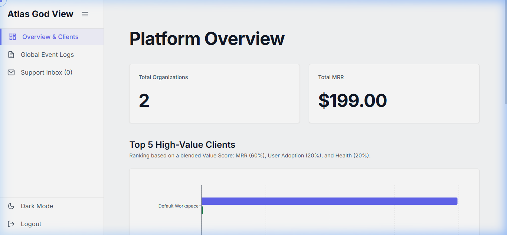
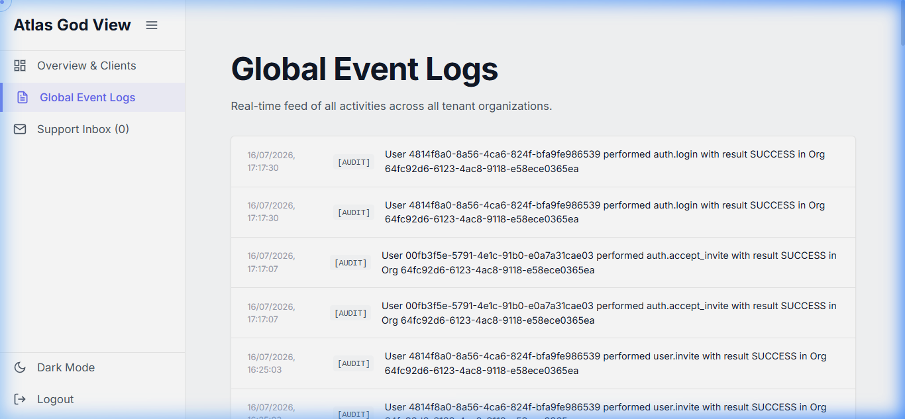
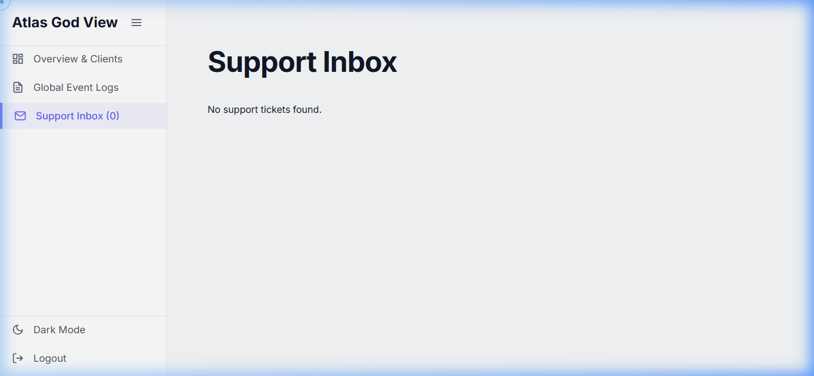

# `apps/saas-portal`

The public front door to Atlas as a product: marketing site, plan comparison, organization signup, and the platform-wide ("God View") admin console used by Atlas staff — not by any single tenant.

- **Framework:** React 18 + TypeScript + Vite
- **Routing:** `react-router-dom`
- **Standalone app:** unlike `apps/frontend`, this app does **not** depend on any `@atlas/*` workspace package (no `@atlas/ui`, `@atlas/auth`, `@atlas/api`) — it's a fully separate codebase with its own styling and its own hand-rolled `fetch` calls to the backend.
- **Default port:** `5174` (set explicitly in `vite.config.ts`)

---

## Previews

### Landing Page & Signup Flow


_Marketing landing page showcasing modular plugin pricing options_


_4-step subscription and billing onboarding flow for new workspace creation_

### Platform God View Console (`/admin`)


_Cross-tenant metrics showing active client lists, MRR tracking, and organization health indexes_

```carousel

<!-- slide -->

```

_Cross-tenant event monitoring logs feed and global support tickets dispatch desk_

---

## Structure

```
saas-portal/
└── src/
    ├── App.tsx                # routes: landing page, /signup, /admin
    ├── components/
    │   ├── Hero/                # landing page hero
    │   ├── About/                 # product overview section
    │   ├── Pricing/                 # plan tiers + CTA buttons → /signup?plan=...
    │   ├── Solutions/                 # plugin/solution highlights
    │   ├── Testimonials/                # social proof
    │   ├── Contact/                       # contact/sales form
    │   ├── GridBackground/                  # landing page background effect
    │   └── CursorDot/                         # landing page cursor effect
    └── pages/
        ├── Signup/               # 4-step organization signup wizard
        └── Admin/                  # platform-wide "God View" admin console
```

---

## Routes

| Route     | Purpose                                                                                     |
| --------- | ------------------------------------------------------------------------------------------- |
| `/`       | Marketing landing page (Hero → About → Pricing → Solutions → Testimonials → Contact)        |
| `/signup` | Organization signup wizard, optionally pre-selecting a plan via `?plan=starter\|enterprise` |
| `/admin`  | Platform admin console ("God View") — separate login, separate data, not org-scoped         |

---

## Signup flow (`/signup`)

A 4-step wizard: **Plan → Account → Billing → Done**.

1. **Plan** — choose Starter ($49/mo) or Enterprise ($199/mo); pre-selected if the user arrived via a `?plan=` link from the pricing section.
2. **Account** — org name (auto-slugified into a URL-safe `orgSlug`, editable), admin's name/email, and a password with live strength feedback.
3. **Billing** — currently a **mocked** Stripe-style card entry UI; the copy is explicit that _"Billing integration coming soon — no charges will be made during setup."_ No real payment provider is wired in yet.
4. **Done** — on success, opens `${APP_URL}/login?registered=true` (the product frontend) in a new tab.

The actual account creation happens in one call: `POST {API_URL}/api/v1/auth/register`, which creates both the `Organization` and its first admin `User` on the backend (see [backend README.md](../backend/README.md)).

---

## Admin console (`/admin`) — "God View"

A separate, self-contained dashboard for Atlas platform staff, not exposed to organization users:

- **Auth:** its own login form posting to `POST /api/v1/auth/super-admin/login`, storing the resulting token in `localStorage` under `atlas_token` (independent of the product frontend's session).
- **Overview tab:** total organizations, total MRR, a "Top 5 High-Value Clients" chart (blended value score: 60% MRR / 20% user adoption / 20% health), and a searchable, paginated table of every organization with health score, MRR, status, and join date.
- **Global Event Logs tab:** cross-tenant system log feed (`GET /admin/logs`).
- **Support Inbox tab:** cross-tenant support tickets (`GET /admin/tickets`), with a "mark resolved" action.

This is the actual "SaaS control tower" for the business — organization health, revenue, and support all in one place — and it's what makes the `healthScore`/`mrr` fields on the `Organization` model (see [backend README.md](../backend/README.md)) meaningful.

---

## Running locally

```bash
pnpm --filter saas-portal dev
# → http://localhost:5174
```

### Environment

| Variable       | Purpose                                                                                 | Default if unset                                                                |
| -------------- | --------------------------------------------------------------------------------------- | ------------------------------------------------------------------------------- |
| `VITE_API_URL` | Backend base URL                                                                        | `http://localhost:3001` (confirm this against your backend's actual `APP_PORT`) |
| `VITE_APP_URL` | Product frontend URL, used for the navbar's "Sign In" link and the post-signup redirect | `http://localhost:5173`                                                         |
