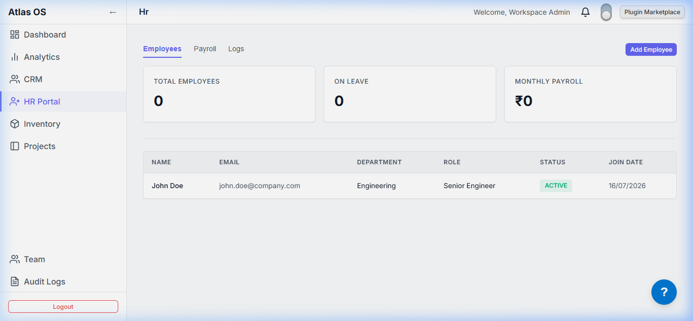
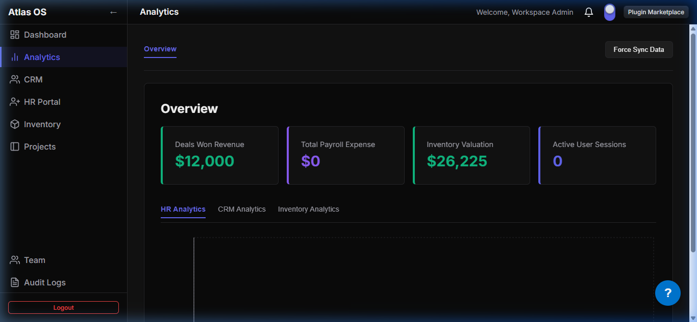

# `plugins/`

Business modules that organizations enable on top of the Atlas core platform, based on their subscription plan. Every plugin is self-contained — it ships its own backend module, frontend UI, and manifest — and plugs into the platform via the **Plugin Manager** (`apps/backend/src/plugins`) and the **frontend plugin host** (`apps/frontend/src/plugins`).

---

## Active Workspace Plugin Previews

Below are screenshots showing the plugins rendering natively inside the client's workspace:

```carousel

<!-- slide -->

<!-- slide -->

<!-- slide -->

```

_A modular catalog of light/dark themed business applications_

---

## Plugin Directory List

Every plugin maintains its own dedicated documentation file:

| Plugin               | Documentation                                                | Included in                   | What it does                                               |
| -------------------- | ------------------------------------------------------------ | ----------------------------- | ---------------------------------------------------------- |
| `inventory`          | [inventory/README.md](inventory/README.md)                   | Starter (opt-in) · Enterprise | Products, warehouses, stock levels & transactions          |
| `crm`                | [crm/README.md](crm/README.md)                               | Starter (opt-in) · Enterprise | Customers, deals pipeline, contact import/export           |
| `hr`                 | [hr/README.md](hr/README.md)                                 | Starter (opt-in) · Enterprise | Employees, leave, payroll                                  |
| `analytics`          | [analytics/README.md](analytics/README.md)                   | Starter (opt-in) · Enterprise | Cross-plugin dashboards, anomaly detection, AI forecasting |
| `project-management` | [project-management/README.md](project-management/README.md) | Enterprise                    | Kanban task boards, milestones, deadlines tracking         |

---

## How a plugin plugs in

Every plugin follows the same shape:

```
<plugin>/
├── manifest.json     # id, permissions, routes, widgets — read by the Plugin Manager
├── package.json      # @atlas/plugin-<id>, built with `tsc`
├── backend/
│   └── src/
│       ├── index.ts           # plugin entry — exported config / NestJS module
│       ├── <plugin>.module.ts # (where present) NestJS module wiring
│       ├── controllers/       # REST endpoints, mounted under /api/v1/<id>
│       └── services/          # business logic, Prisma access
└── frontend/
    └── src/
        ├── index.ts            # plugin entry, registered with the frontend plugin host
        ├── pages/               # top-level dashboard page for the plugin
        └── components/          # plugin-specific UI
```

1. On boot, the backend's **Plugin Manager** scans this directory, reads each `manifest.json`, and upserts a `Plugin` record.
2. Each plugin's NestJS module is loaded and its controllers are mounted under the core API (`/api/v1/<plugin-id>/...`).
3. When an org admin enables the plugin from the **Store** (`apps/frontend`), its frontend entry is mounted into the workspace and its routes/nav items (declared in `manifest.json`) become visible to that organization's users.
4. Plugins talk to each other only through `@atlas/events` (the shared event bus) — never by importing one another directly — so they stay independently deployable.
5. All shared framework code (`@atlas/ui`, `@atlas/plugin-sdk`, `@atlas/utils`, `@atlas/events`, …) comes from `packages/`.

---

## Building a new plugin

1. Scaffold the standard shape above under `plugins/<name>`.
2. Define `manifest.json` against the `PluginManifest` type from `@atlas/plugin-sdk` — id, permissions, routes, nav items, widgets, events.
3. Build the backend module (NestJS) with controllers mounted at `/api/v1/<name>` and a Prisma schema scoped to its own Postgres schema (see `atlas_inventory` / `atlas_crm` / `atlas_hr` in `apps/backend/prisma/schema.prisma` for the pattern).
4. Build the frontend entry (`frontend/src/index.ts`) using `@atlas/ui` for components and `@atlas/events` for cross-plugin communication — never import another plugin's internals directly.
5. Add it to `pnpm-workspace.yaml` if not auto-detected; the Plugin Manager will pick it up automatically on the backend's next boot.
6. Update the plan definitions (`saas-portal/src/components/Pricing`) if the plugin should be gated to specific subscription tiers.

> **Note:** `inventory` and `crm` currently ship with empty `permissions: []` in their manifests, unlike `hr` and `analytics`. If you're adding RBAC checks to those plugins' endpoints, fill in their manifest permissions first — the `PermissionsGuard` in `apps/backend/src/auth` relies on them being declared.
