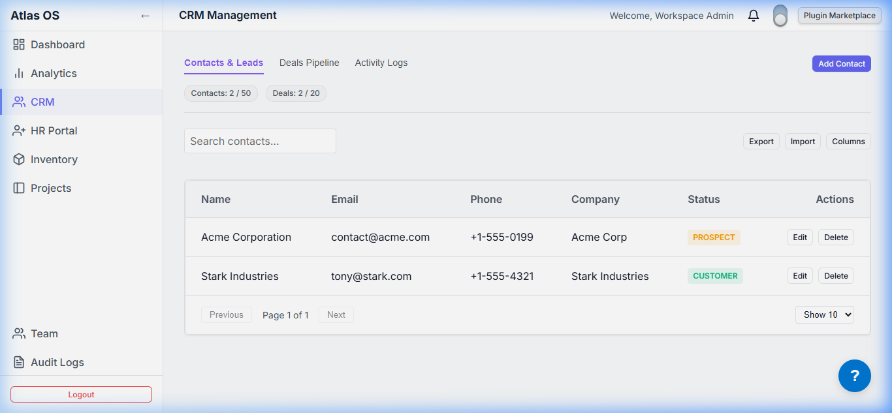

# `plugins/crm`

The Customer Relationship Management (CRM) plugin for the Atlas platform. It manages customers, leads, sales pipeline deals, custom contact fields, and activity logging.

- **Frontend:** React CRM views (`@atlas/plugin-crm`)
- **Backend:** NestJS Module (`apps/backend/src/plugins/crm`)
- **Data Model:** `Customer`, `Deal`, `DealItem`
- **Portals:** Integrates directly into the product workspace navbar dashboard once enabled.

---

## Preview


_Interactive deals pipeline stage tracking and customer lists in Light Mode_

---

## Technical Specifications

- **Pipeline Stages:** Drag-and-drop Deal cards across customizable status columns (`PROSPECT`, `QUALIFIED`, `PROPOSAL`, `NEGOTIATION`, `CLOSED_WON`, `CLOSED_LOST`).
- **CSV Data Exchange:** Enables bulk import and export of CRM contacts per tenant.
- **Tenant Schema Isolation:** Utilizes PostgreSQL Schema `atlas_crm` isolated from other core tables.

---

## Directory Structure

```
crm/
├── manifest.json      # CRM routes, permissions, and pipeline widgets
├── package.json
├── backend/           # NestJS controllers and services
└── frontend/          # React Deals pipeline and customer grid UI
```
