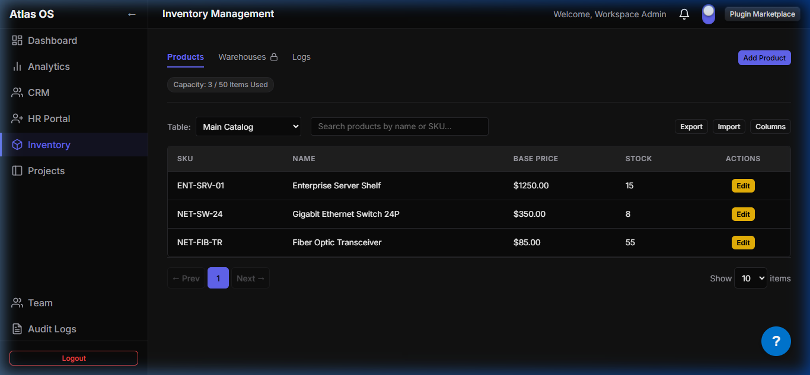

# `plugins/inventory`

The Inventory Management plugin for the Atlas platform. It manages product catalogs, stock listings, multi-warehouse allocations, and transaction logging.

- **Frontend:** React Inventory view (`@atlas/plugin-inventory`)
- **Backend:** NestJS Module (`apps/backend/src/plugins/inventory`)
- **Data Model:** `InventoryTable`, `Product`, `Warehouse`, `Stock`, `StockTransaction`

---

## Preview


_Inventory dashboard tracking warehouse stock levels and product SKUs in Dark Mode_

---

## Key Technical Specifications

- **Dynamic Form Fields:** Supports custom fields on product rows using JSON schemas configured per tenant.
- **Stock Movements:** Every physical stock adjustment registers a `StockTransaction` event, auditing which manager made changes.
- **Multi-Warehouse Isolation:** Supports transferring and querying inventory balances across multiple isolated physical locations.

---

## Directory Structure

```
inventory/
├── manifest.json      # inventory routes and widgets definitions
├── package.json
├── backend/           # NestJS controllers and services
└── frontend/          # React product management grid and Forms UI
```
